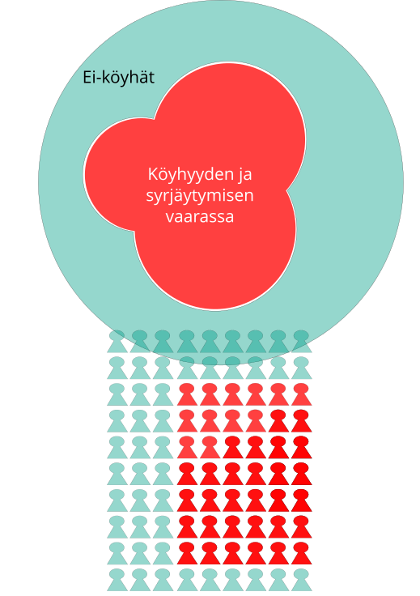

EU2020: Köyhyyden ja sosiaalisen syrjäytymisen vähentämistavoitteet
==============
css: slides.css
transition: fade
transition-speed: fast

Kelan tutkimus 50 vuotta: Kestävä hyvinvointi -seminaaripäivä 5.6.2014 
[Sessio 3: Sosiaalisesti kestävä hyvinvointivaltio? Suomalaisten elinolot ja tulonjako](http://www.kela.fi/kestava-hyvinvointi#Sessio3)

<a href="http://markuskainu.fi">Markus Kainu</a> 
*yliopisto-opettaja*  
[Sosiaalitieteden laitos, Turun yliopisto](https://www.utu.fi/fi/yksikot/soc/yksikot/sosiaalitieteet/Sivut/home.aspx)  

EU2020 köyhyystavoite
===========================================================

>poistetaan köyhyys- tai syrjäytymisvaara vähintään 20 miljoonalta ihmiseltä vuoteen 2020 mennessä

==========================================
type: subsection

<h1>Mitä mitataan ja   kuinka moni on köyhyyden ja syrjäytymisen vaarassa?</h1>

==========================================

## Indikaattori 1: Suhteellinen tuloköyhyysriski

Henkilöt, joiden kotitalouden käytettävissä olevat tulot kulutusyksikköä kohti ovat pienemmät kuin 60 prosenttia maan vastaavasta mediaanitulosta

***

==========================================

## Indikaattori 2: Vakava aineellinen puute

Kotitaloudella on puutteita aineellisessa elintasossa, jos vähintään neljä ehtoa yhdeksästä täyttyy:

1. rästit asuntolainan, vuokran, muiden asumismenojen tai osamaksujen tai muiden lainojen takaisinmaksussa
2. ei mahdollisuutta viikon lomaan kodin ulkopuolella
3. ei mahdollisuutta proteiinipitoiseen ruokaan joka toinen päivä
4. ei varaa hoitaa odottamattomia rahoituskuluja edellisvuoden köyhyysrajaa vastaavaa määrää
5. ei varaa (matka)puhelimeen
6. ei varaa väritelevisioon
7. ei varaa pesukoneeseen
8. ei varaa autoon
9. ei varaa lämmittää asuntoaan riittävästi

***

==========================================

## Indikaattori 3: Vajaatyöllisyys

**Lasketaan kotitalouksien työikäisen (18–59-vuotiaat) väestön työllisyysasteen perusteella**. Kotitalouden työikäiset aikuiset muodostavat potentiaalisen työssä kävijöiden perusjoukon. Heidän työllisinä oloaikansa vuoden aikana kuvaa työssäkäynnin intensiteettiä. 18–24-vuotiaat opiskelijat jätetään laskelman ulkopuolelle. **Kotitalouden työintensiteetti lasketaan suhteuttamalla työikäisten jäsenten työllisyyskuukausien summa kaikkien työikäisten yhteenlaskettuun potentiaaliseen aikaan** (12 kuukautta kullakin). Lopuksi otetaan huomioon kaikki näiden kotitalouksien alle 60-vuotiaat jäsenet, myös lapset. **Mittari kuvaa sitä, kuinka suuri osa väestöstä elää niissä kotitalouksissa, joissa työllisenä oloaika jää vähäisemmäksi kuin 20 prosenttia mahdollisesta työhön käytettävissäolevasta ajasta.**

***

==========================================

## Köyhyyden ja sosiaalisen syrjäytymisen riskin kokonaismittari

Niiden kotitalouden jäsenet ovat köyhyyden ja sosiaalisen syrjätymisen riskissä, joiden kohdalla yksi tai useampi kolmesta indikaattorista toteutuu.

***

==========================================
type: subsection

<h1>Eurooppalaiset elinolot köyhyys- tai syrjäytymisvaaran mittareiden valossa</h1>

========================================================

**Tuloköyhyysriski**

 

==========================================================

**Työintensiteetti**

 

==========================================================

**Materiaalinen puute**

 

==========================================================

**Köyhyyden ja syrjäytymisen vaarassa - kaikki indikaattorit yhdessä**

 

Suomen tilanne tarkemmin
==========================================

 

Tavoitteen ja mittareiden kritiikkiä
===========================================
incremental: false

- kokonaistavoite on määrällinen ja ensisijaisesti EU:n tasolla 
    - isojen maiden köyhyys on iso ongelma
    - pienten maiden köyhyys on pieni ongelma

- tavoitteiden teoriaperusta on ristiriitainen
    - suorat vs. epäsuora mittarit
    - suhteellinen vs. absoluuttinen
- mistä seuraa ongelmia
    - maiden väliseen vertailuun
    - yli ajan vertailuun
    - politiikkojen vaikutusten arviointiin

===========================================

**Neljä köyhyyssuuretta vuonna 2011 (keltainen = 15 %)**

 

===========================================

**EU2020-indikaattoreiden suhde HDI-indikaattoriin**

 

Suhteellisen mittaamisen ongelma
==============================================

Kotitalouden mediaanitulot (keltainen = EU27 mediaanitulo)

 

***

Suhteellinen tuloköyhyysriski (keltainen = EU27 keskiarvo)

 

==========================================
type: subsection

<h1>EU2020 tavoitteiden saavuttaminen</h1>

===========================================================

Köyhyyden ja sosiaalisen syrjäytymisen riskissä olevien **määrät** vuosina **2008 ja 2011** (1000 ihmistä)

 

===========================================================

Köyhyyden ja sosiaalisen syrjäytymisen riskissä olevien määrät vuosina **2011 ja 2012** (1000 ihmistä)

 

==================================================

<h1>Kiitos</h1>

diat & lähdekoodi: [markuskainu.fi/blog/](http://markuskainu.fi/blog/)

