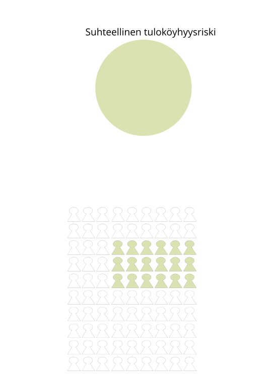

EU2020: Köyhyyden ja sosiaalisen syrjäytymisen vähentämistavoitteet
==============
css: slides.css
transition: fade
transition-speed: fast

Kelan tutkimus 50 vuotta: Kestävä hyvinvointi -seminaaripäivä 5.6.2014 
[Sessio 3: Sosiaalisesti kestävä hyvinvointivaltio? Suomalaisten elinolot ja tulonjako](http://www.kela.fi/kestava-hyvinvointi#Sessio3)

<a href="http://markuskainu.fi">Markus Kainu</a> 
*yliopisto-opettaja*  
[Sosiaalitieteden laitos, Turun yliopisto](https://www.utu.fi/fi/yksikot/soc/yksikot/sosiaalitieteet/Sivut/home.aspx)  

<a href="https://github.com/muuankarski/" style="color:white;">Fork me on GitHub</a>

Sisältö
===========================================================

1. EU2020 köyhyystavoite
    1. Köyhyyden ja sosiaalisen syrjäytymisen vähentämisen **tavoitteet**
    2. Köyhyyden ja sosiaalisen syrjäytymisen vähentämisen **indikaattorit**
2. 

==========================================
type: subsection

<h1>poistetaan köyhyys- tai syrjäytymisvaara vähintään 20 miljoonalta ihmiseltä.</h1>

=======================================

## Suhteellinen tuloköyhyys

Ne henkilöt, joiden kotitalouden
käytettävissä olevat tulot kulutusyksikköä
kohti ovat pienemmät kuin 60 prosenttia
maan vastaavasta mediaanitulosta

## Aineellinen puute

Kotitaloudella on puutteita aineellisessa elintasossa, jos vähintään neljä ehtoa yhdeksästä täyttyy:

1. rästit asuntolainan, vuokran, muiden asumismenojen tai osamaksujen tai muiden lainojen takaisinmaksussa
2. ei mahdollisuutta viikon lomaan kodin ulkopuolella
3. ei mahdollisuutta proteiinipitoiseen ruokaan joka toinen päivä
4. ei varaa hoitaa odottamattomia rahoituskuluja edellisvuoden köyhyysrajaa vastaavaa määrää
5. ei varaa (matka)puhelimeen
6. ei varaa väritelevisioon
7. ei varaa pesukoneeseen
8. ei varaa autoon
9. ei varaa lämmittää asuntoaan riittävästi

## Vajaatyöllisyys

Kotitalouden työikäisten eikuisten työllisinä oloaikana vuoden aikana kuvaa työssäkäynnin intensiteettiä. Mittari kuvaa sitä, kuinka suuri osa väestöstä elää niissä kotitalouksissa, joissa työllisenä oloaika jää vähäisemmäksi kuin 20 prosenttia mahdollisesta työhön käytettävissä olevasta ajasta.

=========================================

===========================================

===========================================

===========================================

===========================================
type: subsection

<h1>Suomi kansainvälisessä vertailussa</h1>

==============================================

Neljä köyhyyssuuretta vuonna 2012 (keltainen = 15 %)

 

===========================================================

Köyhyyden ja sosiaalisen syrjäytymisen riskissä olevien* **määrät** vuosina **2008 ja 2011** (1000 ihmistä)

 

===========================================================

Köyhyyden ja sosiaalisen syrjäytymisen riskissä olevien määrät vuosina **2011 ja 2012** (1000 ihmistä)

 

=============================================================

Kotitalouksien kulutusyksikköpainotettujen käytettävissä olevien tulojen jakaumat maittain vuonna 2011 (lähde: EU-silc 2010)

 
